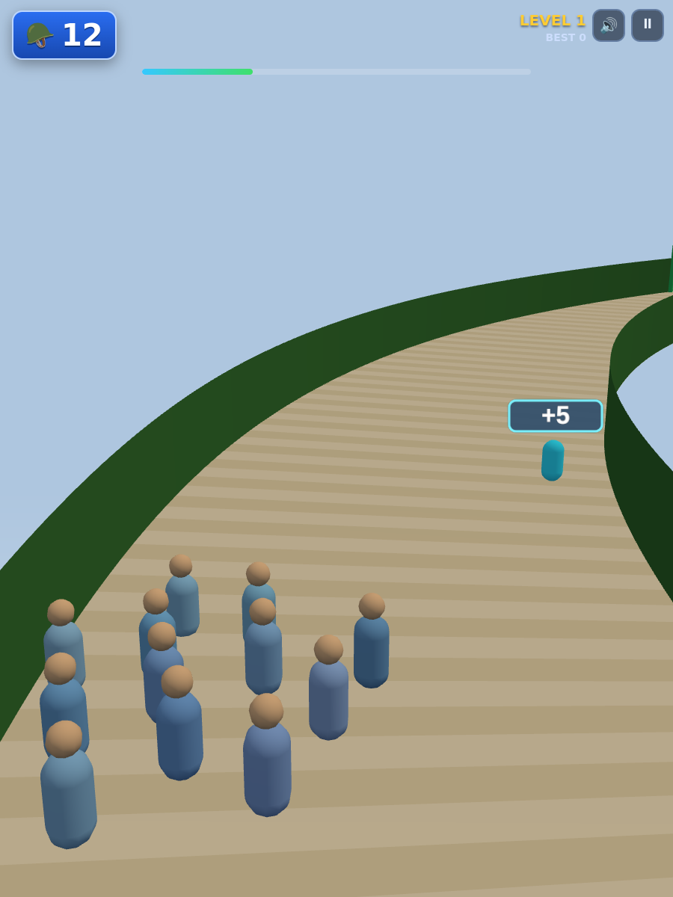
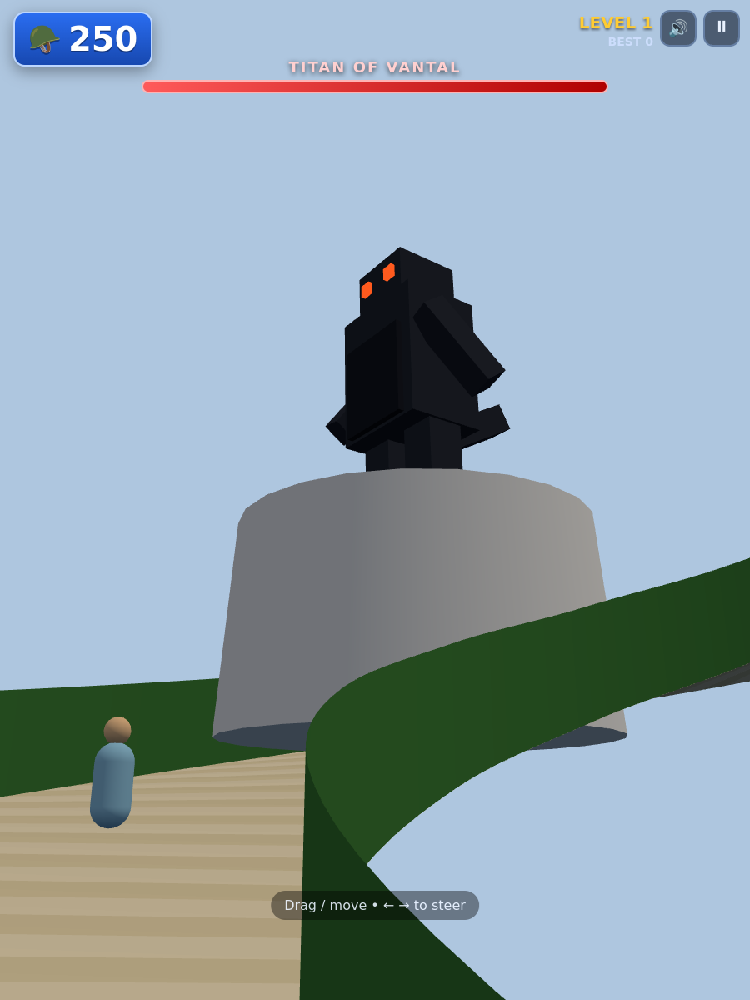

# 🎮 Silly Games

A tiny **Netflix-style arcade** of browser games — a landing page where you pick a game and
play instantly. **No installs, no backend, 100% client-side.** It deploys as a static
GitHub Page and runs entirely in the visitor's browser (so there's nothing to bill).

| | |
|---|---|
| **Hub** (game picker) | `index.html` at the repo root |
| **First game** | 🦖 **[Crowd Ascent](games/crowd-ascent/)** — a 3D crowd-runner ([design doc](games/crowd-ascent/SCENARIO.md)) |




---

## 🗂️ Structure

```
index.html                     # the Netflix-style hub (game gallery)
hub/
  hub.css  hub.js              # hub styling + rendering
  registry.json               # ← the catalog: list of game ids
games/
  game.schema.json            # schema for each game's game.json
  _template/                  # copy this to start a new game
  crowd-ascent/                # a fully self-contained game
    index.html
    game.json                  # ← this game's hub metadata
    css/  js/  vendor/  docs/
    SCENARIO.md
scripts/validate-games.mjs     # catalog validator (runs in CI)
serve.js                       # zero-dependency local server
Makefile  package.json
.github/workflows/             # deploy-pages.yml + validate.yml
docs/                          # local-only, git-ignored (scratch / local notes)
```

Each game lives in its own self-contained folder under `games/` (its own HTML/CSS/JS and
vendored libraries) plus a `game.json`. The hub reads `hub/registry.json` to know which
games to show, then loads each game's `game.json` for its card.

---

## ▶️ Run it locally

These are static files using ES modules, so they must be served over **HTTP** (opening
`index.html` from `file://` won't work). Pick any option:

```bash
npm start                      # → http://localhost:8000   (just Node, zero deps)
# or
python3 -m http.server 8000    # → http://localhost:8000   (just Python)
# or
make serve                     # → http://localhost:8000   (make help lists targets)
```

Then open the URL — you'll land on the hub; click a game to play.

---

## 🚀 Deploy to GitHub Pages (free, client-side)

This is a static site — GitHub Pages hosting is **free for public repos**, and the game runs
in the visitor's browser, so **there are no compute charges**.

A Pages workflow is included ([`.github/workflows/deploy-pages.yml`](.github/workflows/deploy-pages.yml)).

1. Push this repo to GitHub (`main`).
2. On GitHub → **Settings → Pages → Build and deployment → Source: GitHub Actions**.
3. Every push to `main` publishes to `https://bankh.github.io/silly_games/`.

> Actions is free & unlimited for **public** repos. Prefer **zero** Actions usage? Use
> **Settings → Pages → Deploy from a branch → `main` / `/ (root)`** instead — the included
> `.nojekyll` keeps `hub/`, `js/`, and `vendor/` served as-is.

---

## ➕ Add a new game (pull requests welcome!)

The process is standardized and CI-validated. Quick version:

```bash
cp -r games/_template games/my-game-id   # copy the template
# build your game in games/my-game-id/, fill in its game.json
# add "my-game-id" to the "games" list in hub/registry.json
npm run validate                          # same check CI runs on your PR
```

Then open a pull request. See **[CONTRIBUTING.md](CONTRIBUTING.md)** for the full guide,
field reference, and rules. The catalog schema is [`games/game.schema.json`](games/game.schema.json).

---

## 🛠️ Tech notes

- **Crowd Ascent** uses **Three.js r160**, vendored in `games/crowd-ascent/vendor/` → no
  external runtime dependency (works offline, no CDN risk). Soldiers render via
  `InstancedMesh`; the road is a conical-helix `CatmullRomCurve3`. High score persists in
  `localStorage`.
- The hub is plain HTML/CSS/JS — no framework.

## License
MIT
